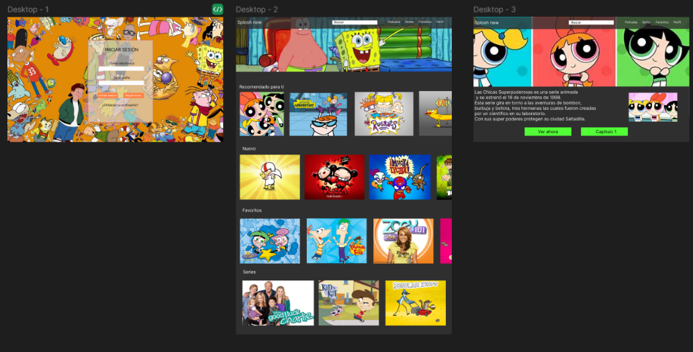
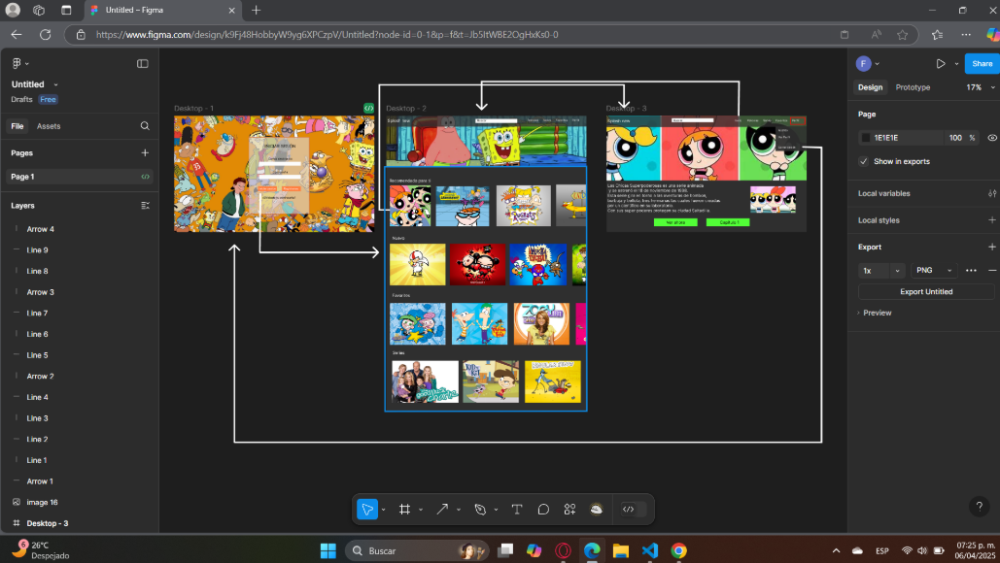
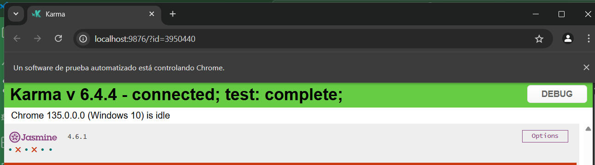
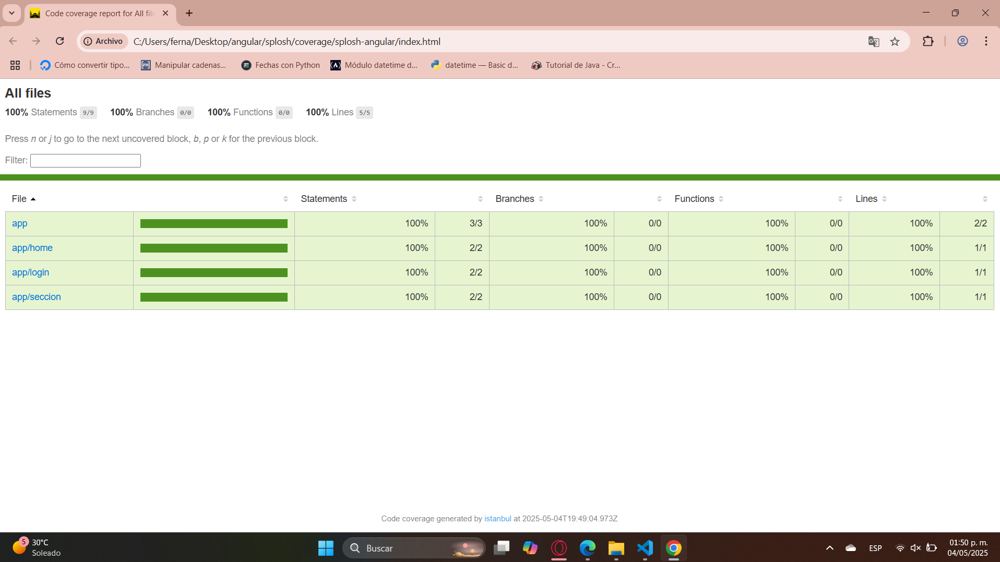

El nombre de mi web app es "Splosh new"

Este es un sitio donde uno puede ver ya sean peliculas y series. Este tipo de contenido va para todas las edades, ya que contiene variedad de entretenimiento. Decidi hacer este sitio de series y peliculas antiguos que pasaban en la TV entre los 90's y los 2000's, si bien ya existe disney donde podemos encontrar algunos programas y peliculas que tiene, no estan todos los que se veian cuando eramos niños. Además que aun no hay una plataforma donde podamos encontrar los tres programas de televisión que antes se veían, como son nickelooden, disney, disney xd y cartoon network. Este sitio es para recordar las series de nuestra infancia, divertirnos y pasarla agusto.

Este sitio tu puedes elegir que deseas ver y es muy facil de entender para el usuario, asi como facil de manipular.

 
Esta es una imagen de mi proyecto ejecutandose 

Para usar este repo es muy intuitivo, una vez descargado solo necesitas abrir el proyecto, verlo en tu navegador.
Se inicia sesión con llenando los datos.
Ya tu puedes ver el contenido de la pagina, el unico que te direcciona tambien a otro contenido es el de las chicas super poderosas y en el navbar puede regresar al inicio o cerrar sesión y volver al login.

Primero para hacer esta pagina hice la maquetación para saber como la queria, tenía la idea pero debía centrarla. Queria hacer algo en donde estuvieran todos los programas que veía de niñas, de varias producciones de televisón. Una vez hecho esto busque las imagenes que queria que aparecieran y ya con la maquetación empece la codificación, creando el login, despues el index y por ultimo una opcion de ver algo, que en este caso fue el de las chicas super poderosa.

Los problemas que vi en mi proyecto es el cargo de las imagenes o los fondos y los estilos, que si bien cuando migre mi 
proyecto de base a angular algunos estilos si los tomo,, pero otros no los toma, por como funciona angular 

Hice bien el que funcionara y se mustre la mayor parte del proyecto a como lo tenia desde un principio antes de usar angular 

No salio bien que los estilos no se implementaron al 100%

Puedo mejorar mi proyecto a que se vea mejor ya que con forme use angular se va a ver mejor. 

Hice un nuevo repo por eso todo dice que lo hice hoy, pero fue porque apenas lo subi hoy, eso no significa que lo hice hoy, si no que volví a crear uno nuevo.
Pero este ya es bueno, en el cual estoy trabajando. 

Actualmente los problemas es al momento de la conexión a la base de datos, solo son pequeños detalles. 

Mejoraria de mi proyeto la apariencia y todos los estilos, que los voy a modificar para que se vea más atractivo y además funcional. 