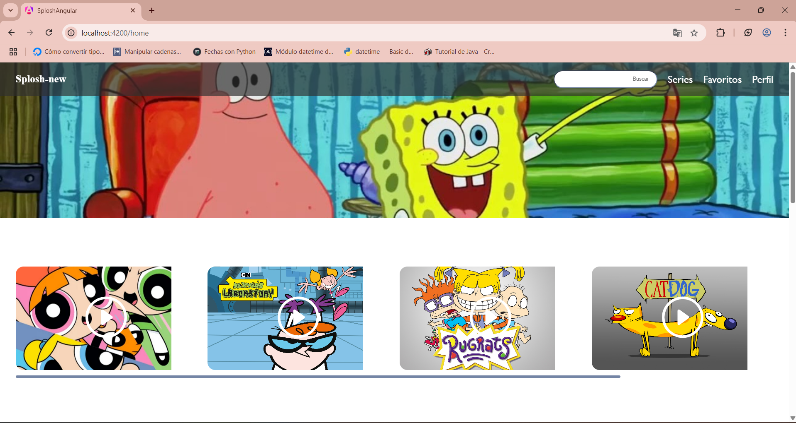

Splosh en Angular

Es una aplicacion de series en el cual muestra series de los años 90's a los 2000's
Aqui cualquier persona puede ver las series mas vistas durante los años 2000's 

 
 Esta es una imagen de mi proyecto ejecutandose 

 Los problemas que vi en mi proyecto es el cargo de las imagenes o los fondos y los estilos, que si bien cuando migre mi 
 proyecto de base a angular algunos estilos si los tomo,, pero otros no los toma, por como funciona angular 

 Hice bien el que funcionara y se mustre la mayor parte del proyecto a como lo tenia desde un principio antes de usar angular 

 No salio bien que los estilos no se implementaron al 100%

Puedo mejorar mi proyecto a que se vea mejor ya que con forme use angular se va a ver mejor. 

(image-1.png)
(image-2.png)

Hice un nuevo repo por eso todo dice que lo hice hoy, pero fue porque apenas lo subi hoy, eso no significa que lo hice hoy, si no que volví a crear uno nuevo.
Pero este ya es bueno, en el cual estoy trabajando. 